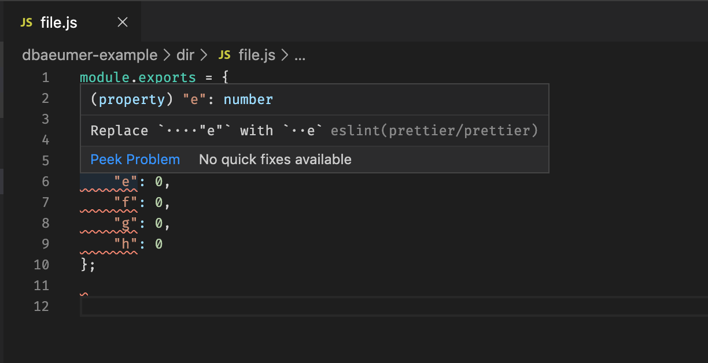

This repo illustrates an apparent issue with the new vscode-eslint plugin
formatter with regards to the prettier eslint plugin and prettierignore files.

Neither prettier nor eslint will format `dir/file.js`:

```
$ eslint dir/file.js

$ prettier dir/file.js
dir/file.jsmodule.exports = {
    "a": 0,
    "b": 0,
    "c": 0,
    "d": 0,
    "e": 0,
    "f": 0,
    "g": 0,
    "h": 0
};
```

However, the plugin will show errors and format them on save:



This was tested with VS Code 1.41.0-insider (commit
455d8f73cd7c73285fba70ab039a26279f19bb57) and [vscode-eslint 2.0.2-next.1][1].


[1]: https://github.com/microsoft/vscode-eslint/issues/815
